# Convolutional Neural Netwrok (CNN)
---

Convolutional Neural Networks are a feed-forward Artificial Neural Networks. However, unlike traditional neural networks, in CNNs neurons may not be fully-connected to all neurons of the previous layer, in this case each neuron will be connected to local region which is called a receptive field.
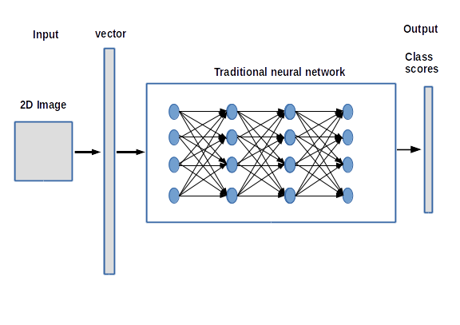
 > *** Fig1 ***: Fully connected neural network

Let's take the example of a 28 x 28 pixel image as an input. A traditional feed-forward neural network will need 784(=28 x28) neurons just in the Input layer, therefore for bigger resolutions the number of parameters will be hardly manageable and  will require a lot of memory. In addition the image will be considered as a long vector of pixel values and then we will loose the spatial structure of the image, in other words, we will not take advantage of the fact that neigbhor pixels could be highly correlated.

> ***Fig2 ***: Convolutional neural netwrok

However the CNNs are designed to connect hidden neurones to small and localized regions in the Input image through receptive fields. So each neuron in the input layer will consider a local region of pixels instead of just a single pixel.
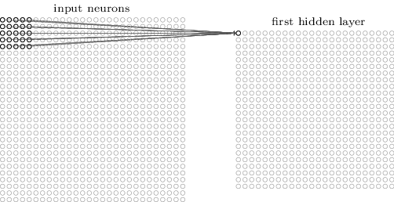
> ***Fig3*** : First hidden neuron connected to a local region (to change)

Then we slide the receptive filed to connect a second hidden neuron and so on. 
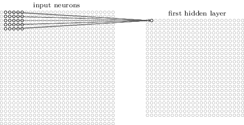
> ***Fig4*** : Second hidden neuron connected to an other local region (to change)


#### So after connecting the neuron to its receptive field, how do we calculate the output of the neuron ?

At this step we will use a ***filter***(or kernel) which is a 2D matix of weights, we convolute the filter with the receptive field of the neuron to get the output.

After convoluting the same filter with the input image through all the receptive fields we get a ***feature map*** which contains the output values of the neurones, as a result these neurones will share the some weights of that filter.

At this step the ***feature map*** is the result of ***convoluting*** a ***filter*** with the ***input*** image.
Notice that we can use multiple filters in the some layer and each filter will give us a feature map.

***NB***: Using a ***convolution*** [ $g*f(x,y) =\iint_{\infty} f(x,y).g(x-i, y-j) \, di \, dj $]

   or ***cross correlation***[ $g \otimes f(x,y) =\iint_{\infty} f(x,y).g(x+i, y+j) \, di \, dj $]  gives us the same results.

Let's take an example of a CNN that was trained to recognize square and triangle shapes. 
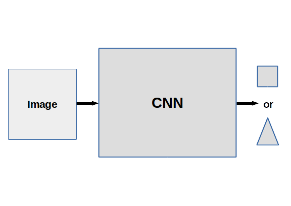
We suppose that one of the filters is a small square (3X3 pixels), we convolute the filter with the input to find out the regions that match with this feature.
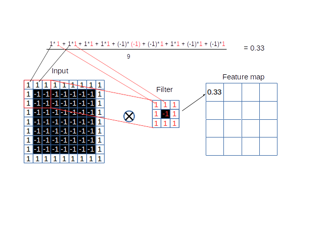
After calculating the output of the first neuron we translate the filter with two strides to calculate the second output.
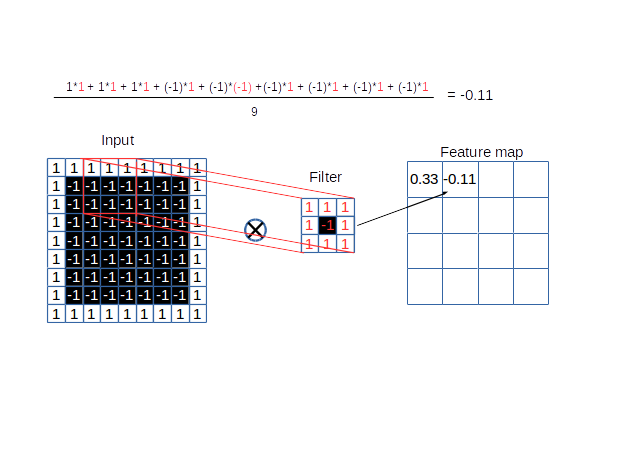
As you notice, we get four corners with maximum values  and a lot of negative values, which means that the input image matchs more with the filter in these corners. 
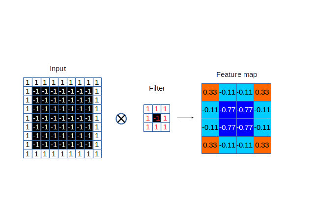
This is an example of a cross-correlation of two images, sometimes it's necessary to filter the images before calculating the cross-correlation product. So here we took the image of a woman face "lena", we filtered the image of the face and then we calculated the cross-correlation product of the face image and the eye image.
As you can see, there is a pick in each eye region.
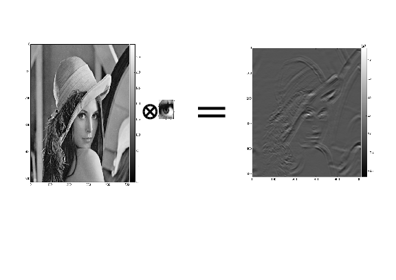

As we are not interested in negative values we use a non-linear function to eliminate these values. This function is called the ***activation function of the neuron***, in this case we will use a rectifier activation $ max(0,x)$

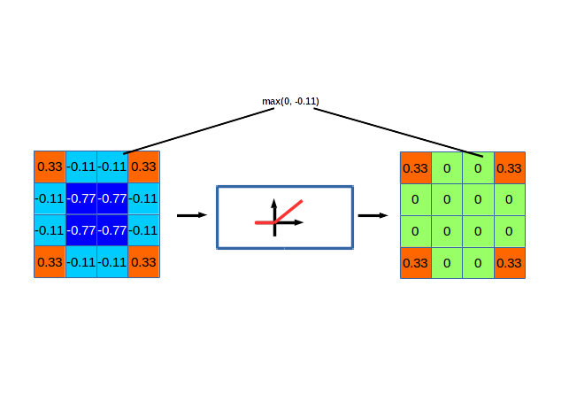

After eliminating negative values, we get a lot of zeros. To reduce the size of the feature map without loosing a lot of informations we use ***Pooling layers***. Let's pick a window size (2x2) and a stride (1), we walk the window across the filtered image (feature map) and from each window we take the maximum value.
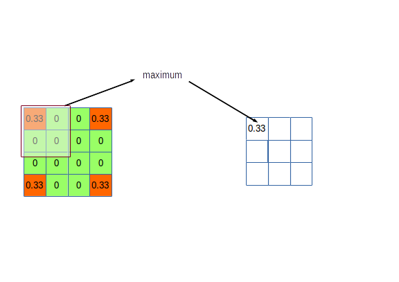
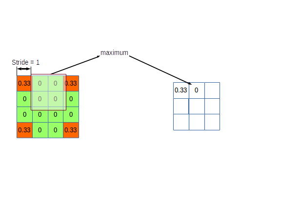
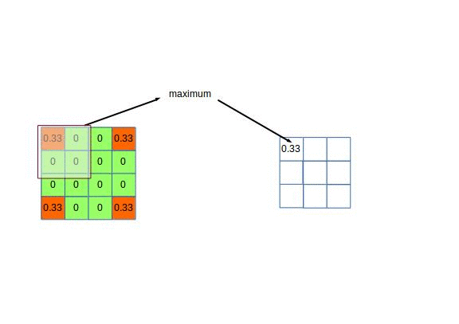
And this is our final feature map which will be used as an input for the next convolutional layers.
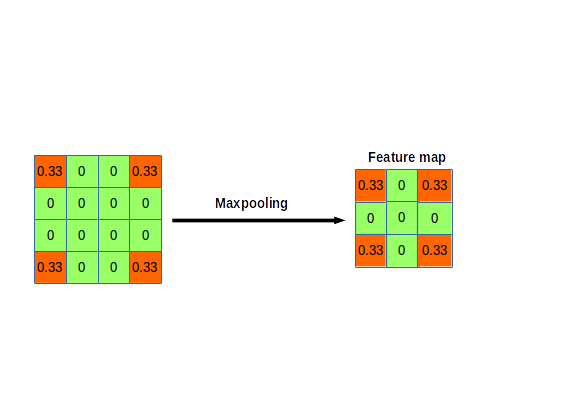
So a convolutional layer can be a sequence of three main operations: Convolution, activation function and pooling. The order can differ, it depends on the design of the network.
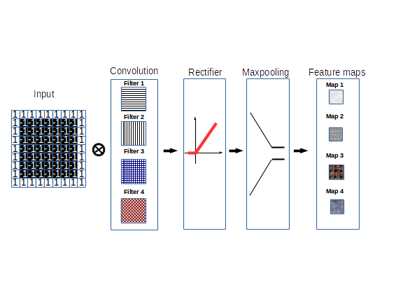
At the end of the convolutional layers we reshape our maps to get a single vector of values, this vector will be the input to the fully-connected layers, these layers define a traditional network, this network will make the final classification and give us the final result. 

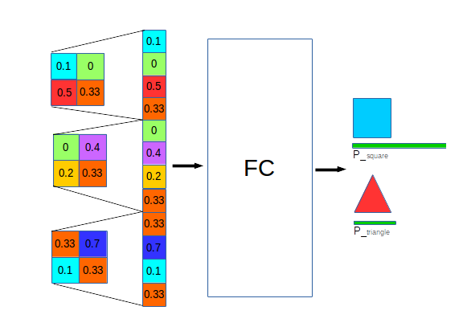


### Summary

In CNNs we have two parts:
#### 1. Convolutional Layers: 
A convolutional layer is a sequence of three operations:
- ***Convolution***: We convolute a filter with the layer input to get a feature map. The main idea of the convolution is to take a feature and then find out which regions of the image match most with this feature.
 
- ***Normalization*** : We use a non-linear transfer function as part of activation, the rectifier activation ($ max(0,x) $) is very common in convolutional layers.

- ***Pooling*** : Pooling layers shrink the feature maps and reduce their sizes without loosing a lot of informations.
    
#### 2. Fully-connected Layers
Fully-connected layers form a traditional neural network responsable of the final step of classification which will give us the final result (OUTPUT).
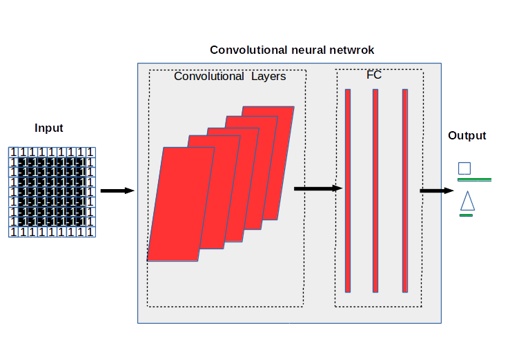
> ***Fig5*** : Convolutional neural network


### Hyperparameters (move this section)

There are some paramaters that should be defined by the developper when making the design of the network:
    1. Convolution:
        - Number of features/filters
        - Size of features
    2. Pooling:
        - Window size
        - Window stride
    3. Fully-connected layers:
        - Number of neurones
After setting the design and the paramaters, the neural network start the learning process, it uses the ***backpropagation*** methode to set the weights of the filters/kernels, so the problem become a problem of ***optimization***.


The architecture of CNNs have many advantages in image recognition:
    1. Use few parameters comparing to tradional neural networks 
    2. Invariant to object position and distortion in the scene
    3. Automatically learn and generalize features from the Input domaine
CNNs can deal with other types of data(2D/3D) and not just images, the input can also be a sound or a text, the most important is that data have to be presented in a such way that closer things are more closely related than things away.
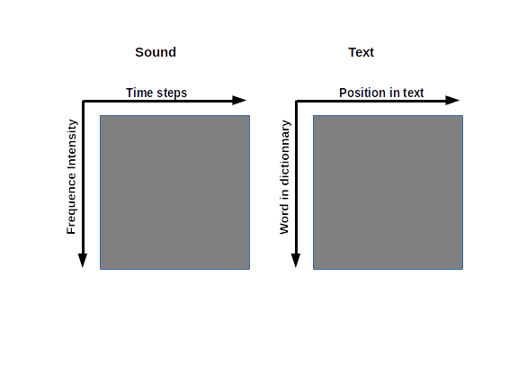

## How do CNNs learn?
---
In the previous part we explained the process of classification in CNNs, we saw how a trained CNN take an input and then pass this input through convolutional layers to get feature maps and then through fully-connected layers to finally get the result of the classification. However we skiped the most important part which is the creation and learning process of a CNN. So in this part we will try to explain the main steps of generating a functional CNN.
Like traditional neural networks the first thing to do is to create a model, in other words to define the architecture of the neural network, after that we have to train the model to be able to make a pertinant classifcation and in order to get good results we need a good dataset, the bigger and more variant the dataset is the better results we get. 
***

### 1-Model Design
---
As we said before the first step is the design of the model, a CNN is a sequence of convolutional layers and fully connected layers. So we have to fix the number of convolutional layers and FC layers, the number of layers define the depth of the network. Deeper networks can deal with complex problem however deeper networks require a lot of computing ressources and take more time during classification, in addition if the network is deeper than needed we can face an overfitting problem which means poor predictive/classification performance, it will overreact to minor fluctuations in the training data.
In the opposite case, if the depth of the network is less than needed we will face an underfitting problem which means that the model is not flexible enough to fit the data.
(What is the difference between having many layers and few layers if we have the same number of parameters in total?)
(Depth versus freedom degree)

> Underfitting and overfitting models(to change)

As we know there is no theorem that define how should be the depth of the network but the common methode is to start with an overfitting network and then optimize the model until getting a good configuration.
So the parameters that should be fixed by the designer at this level are:

    -Number of Convolutional Layers
    -Number and Size of filters in each layer
    -Number Size and Placement of Pooling layers
    -Number of Fully-Connected layers
    -Number of neurones of each FC layer

### 2-Dataset
---
Now we have our model and we are ready to train the neural network so we will need a dataset; a dataset should be labeled which means each input has its associated output, for example if the input is an image of an object, let's say an image of a car, so we should mention to the model that the output of this input should be "car".
One image of a "car" is not sufficient if we want to learn the neural network how to recognize a car because there are many types of cars and the image can be taken from many angles so we have to provide a lot of images so that the network can extract the necessary patterns of car recognition.


### 3-Training (Backpropagation Algorithm)
---
So now we have all we need to train our neural network; we have a model and a dataset. Training a neural network is equivalent to find the weights that will make the network able to perform a classification so how to do that?
The idea is simple, we take an input, we compute the output of the neural network, we measure the error/distance between the obtained output and the desired output, we look for the weights that minimize this error and then we update the network, we take another input and we repeat the same process and so on. As you notice it's an optimization problem but with a big number of parameters which can be millions therefore we cannot solve this problem with traditional methods.
Before we pass to the methods of solving such problem, how do we measure the error? In the previous example we said that the output should be "car" but the output of the neural network is a vector of values, well it's not a big problem, by a simple preporcessing of the dataset we can convert the vector of labels to a vector of classes socres.

Once we have a vector of classes scores we have to compute the error between the output and the *** Loss/Objective function ***. The loss function depends on the nature of the problem:
 1- Regression (Mean squared error)
 2- Binary classification (binary entropy)
 3- Multi-class classification (cross entropy)

    -Loss/Objective function (Cross_entropy, Binary_entropy, Mean_Squared_Error)
    -Error Measurement
    -Gradient Measurement & Update of Weights (SGD, Adam,...)
    -Number of Iterations

## Implimentation of a CNN using Keras Library(Python)

In this part we will implement a convolutional neural network using Keras which is a python library for neural networks. Keras is a wrapper that can use either Tensorflow or Theano as a backend.

### Handwritten digit recognition (MNIST)

The MNIST problem is a dataset developped for evalutationg machine learning models. The data set was constructed from scanned documents. It was well prepared to be a good dataset for handwritten digit recongnition.
Each image is a 28 by 28 pixel square of a number between 0 and 9.

##### 1.Load the data


```python
%matplotlib inline
from keras.datasets import mnist
import matplotlib.pyplot as plt
(X_train, y_train), (X_test, y_test) = mnist.load_data()
# plot 4 images as gray scale
plt.subplot(221)
plt.imshow(X_train[1], cmap=plt.get_cmap('gray'))
plt.subplot(222)
plt.imshow(X_train[2], cmap=plt.get_cmap('gray'))
plt.subplot(223)
plt.imshow(X_train[3], cmap=plt.get_cmap('gray'))
plt.subplot(224)
plt.imshow(X_train[4], cmap=plt.get_cmap('gray'))
# show the plot
plt.show()
```

    Using Theano backend.


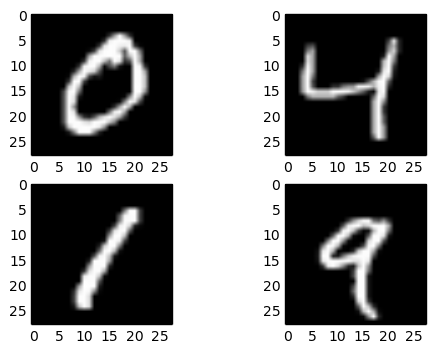


##### 2. Load the classes we will need


```python
import numpy
from keras.models import Sequential
from keras.layers import Dense
from keras.layers import Dropout
from keras.layers import Flatten
from keras.layers.convolutional import Convolution2D
from keras.layers.convolutional import MaxPooling2D
from keras.utils import np_utils
from keras import backend as K

```

#####  3.Fixing a random seed allows us to reproduce the some process with the same random values


```python
seed = 1
numpy.random.seed(seed)
```

##### 4.Reshape the data to be [samples][channels][width][height]


This order is defined by the function(***set_image_dim_ordering***)
In the case of gray images the number of channels is 1,and for RGB the number of channels is 3
Don't forget to set the type of data as float otherwise when normalizing the data we will get zeros and ones.


```python
K.set_image_dim_ordering('th')
X_train = X_train.reshape(X_train.shape[0],1,28,28).astype('float32')
X_test = X_test.reshape(X_test.shape[0], 1, 28, 28).astype('float32') 
```

##### 5.Normalize the inputs from 0-255 to 0-1


```python
X_train /= 255
X_test /= 255
```

##### 6.Transfrom the output from a vector of labels to k-class vectors

Instead of giving each input a label we will put 1 in the associate class vector and 0s in the others.


```python
y_train = np_utils.to_categorical(y_train)
y_test = np_utils.to_categorical(y_test)
num_classes = y_test.shape[1]
```

##### 7.Define our model in a class

In this example we will consider a simple convolutional neural network with the following configuration:
    1. Convolutional layer which have 32 (5x5) features and a rectifier activation function
    2. Max pooling layer with 2x2 window
    3. Flatten layer to convert the data from 2D matrix to a vector
    4. Fully-connected layer with 128 neurones and a rectifier activation
    5. Fully-connected layer with k neurones (k: numbre of classes) with a softmax activation
    6. In this example we have multi-class classification so we will use the Logarithmic Loss function and the ADAM gradient decent algorithm 


```python
def baseline_model():
    model = Sequential()
    model.add(Convolution2D(32, 5, 5, border_mode ='valid', input_shape=(1,28,28), activation='relu'))
    model.add(MaxPooling2D(pool_size = (2,2)))
    model.add(Flatten())
    model.add(Dense(128, activation ='relu'))
    model.add(Dense(num_classes, activation='softmax'))
    #compile model
    model.compile(loss='categorical_crossentropy', optimizer='adam', metrics=['accuracy'])
    return model
```

##### 8. Build and train the model

We will train the model over 10 epochs using a btach size of 200
``` 
One epoch = one forward pass + one backward pass of all the training examples
Batch size = number of training examples in one forward/backward pass
One pass = forward + backward
Nbr of iterations = nbre of passes
```
Example: 1000 training examples + batch size = 500  ---->  2 iterations to complete one epoch


```python
#build the model
model = baseline_model()
#Fit the model
history = model.fit(X_train, y_train, validation_data = (X_test, y_test), batch_size = 200, nb_epoch = 10, verbose = 2)

```

    Train on 60000 samples, validate on 10000 samples
    Epoch 1/10
    96s - loss: 12.9143 - acc: 0.1979 - val_loss: 11.5905 - val_acc: 0.2805
    Epoch 2/10
    95s - loss: 11.4613 - acc: 0.2884 - val_loss: 11.3733 - val_acc: 0.2940
    Epoch 3/10
    110s - loss: 9.8512 - acc: 0.3881 - val_loss: 9.5937 - val_acc: 0.4044
    Epoch 4/10
    105s - loss: 9.6260 - acc: 0.4024 - val_loss: 9.5595 - val_acc: 0.4063
    Epoch 5/10
    107s - loss: 9.5928 - acc: 0.4045 - val_loss: 9.5388 - val_acc: 0.4078
    Epoch 6/10
    111s - loss: 9.5878 - acc: 0.4049 - val_loss: 9.5634 - val_acc: 0.4060
    Epoch 7/10
    115s - loss: 9.5632 - acc: 0.4064 - val_loss: 9.6236 - val_acc: 0.4024
    Epoch 8/10
    113s - loss: 9.2627 - acc: 0.4246 - val_loss: 8.0768 - val_acc: 0.4978
    Epoch 9/10
    107s - loss: 8.1445 - acc: 0.4938 - val_loss: 8.0965 - val_acc: 0.4971
    Epoch 10/10
    140s - loss: 8.0893 - acc: 0.4974 - val_loss: 8.0290 - val_acc: 0.5017


##### 9. Evaluate the model


```python
scores = model.evaluate(X_test, y_test, verbose = 0)    
print ("Classification Error: %.2f%%" % (100 - scores[1]*100))
```

    Classification Error: 49.83%


```python
    
#Plot
plt.figure(1)
plt.subplot(211)
plt.plot(history.history['acc'])
plt.plot(history.history['val_acc'])
plt.title('model ')
plt.ylabel('acc')
plt.legend(['train','test'], loc ='upper right')
plt.subplot(212)
plt.plot(history.history['loss'])
plt.plot(history.history['val_loss'])
plt.title('model loss')
plt.xlabel('epotch')   
plt.ylabel('loss')
plt.legend(['train','test'], loc = 'upper right')
plt.show()
```


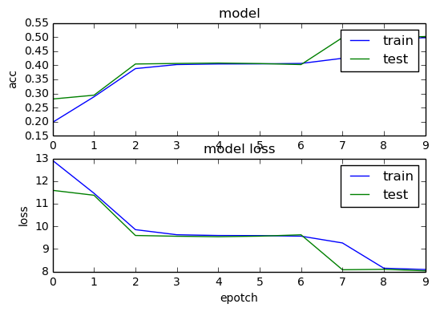


### Larger CNNs

    1.Convolutional layer with 10 (7x7) features
    2.MaxPooling layer 
    3.Convolutional layer with 20 (3x3) features
    4.Fully-connected layer 60 neurones
    5.Fully-connected layer 10 neurones


```python
#define model
def baseline_model2():
    # create model
    model = Sequential()
    model.add(Convolution2D(10, 7, 7, border_mode='valid', input_shape=(1,28,28), activation = 'relu'))
    model.add(MaxPooling2D(pool_size = (2,2)))
    model.add(Convolution2D(20, 3,3, activation='relu'))
    model.add(Flatten())
    model.add(Dense(60, activation = 'relu'))
    model.add(Dense(num_classes, activation='softmax'))
    # compile model
    model.compile(loss='categorical_crossentropy', optimizer='adam', metrics=['accuracy'])
    return model
#create model
model2 = baseline_model2()
#fit the model
history2 = model2.fit(X_train, y_train,validation_data=(X_test, y_test), batch_size = 200, nb_epoch=10, verbose = 2)
scores2 = model2.evaluate(X_test, y_test)
print ("Classification Error %.2f%%" % (100 - 100* scores2[1]))
```

    Train on 60000 samples, validate on 10000 samples
    Epoch 1/10
    73s - loss: 5.3489 - acc: 0.6287 - val_loss: 0.1887 - val_acc: 0.9442
    Epoch 2/10
    55s - loss: 0.1239 - acc: 0.9638 - val_loss: 0.0955 - val_acc: 0.9737
    Epoch 3/10
    59s - loss: 0.0590 - acc: 0.9823 - val_loss: 0.0889 - val_acc: 0.9775
    Epoch 4/10
    58s - loss: 0.0368 - acc: 0.9889 - val_loss: 0.0725 - val_acc: 0.9798
    Epoch 5/10
    57s - loss: 0.0234 - acc: 0.9927 - val_loss: 0.0824 - val_acc: 0.9798
    Epoch 6/10
    58s - loss: 0.0210 - acc: 0.9928 - val_loss: 0.0995 - val_acc: 0.9784
    Epoch 7/10
    56s - loss: 0.0143 - acc: 0.9951 - val_loss: 0.0854 - val_acc: 0.9808
    Epoch 8/10
    58s - loss: 0.0160 - acc: 0.9947 - val_loss: 0.0919 - val_acc: 0.9785
    Epoch 9/10
    56s - loss: 0.0150 - acc: 0.9949 - val_loss: 0.0793 - val_acc: 0.9824
    Epoch 10/10
    60s - loss: 0.0118 - acc: 0.9961 - val_loss: 0.1078 - val_acc: 0.9796
    10000/10000 [==============================] - 7s     
    Classification Error 2.04%


    1.Convolutional layer with 10 (7x7) features
    2.MaxPooling layer 
    3.Convolutional layer with 20 (5x5) features
    4.Convolutional layer with 30 (3x3) features
    5.Fully-connected layer 180 neurones
    4.Fully-connected layer 60 neurones
    5.Fully-connected layer 10 neurones 


```python
#define model
def baseline_model3():
    # create model
    model = Sequential()
    model.add(Convolution2D(10, 7, 7, border_mode='valid', input_shape=(1,28,28), activation = 'relu'))
    model.add(MaxPooling2D(pool_size = (2,2)))
    model.add(Convolution2D(20, 3,3, activation='relu'))
    model.add(Dropout(0.5))
    model.add(Flatten())
    model.add(Dense(60, activation = 'relu'))
    model.add(Dense(num_classes, activation='softmax'))
    # compile model
    model.compile(loss='categorical_crossentropy', optimizer='adam', metrics=['accuracy'])
    return model
#create model
model3 = baseline_model3()
#fit the model
history3 = model3.fit(X_train, y_train,validation_data=(X_test, y_test), batch_size = 200, nb_epoch=10, verbose = 2)
scores3 = model3.evaluate(X_test, y_test)
print ("Classification Error %.2f%%" % (100 - 100* scores3[1]))
```

    Train on 60000 samples, validate on 10000 samples
    Epoch 1/10
    68s - loss: 3.5173 - acc: 0.7158 - val_loss: 0.1801 - val_acc: 0.9468
    Epoch 2/10
    63s - loss: 0.2324 - acc: 0.9320 - val_loss: 0.0957 - val_acc: 0.9690
    Epoch 3/10
    62s - loss: 0.1447 - acc: 0.9579 - val_loss: 0.0659 - val_acc: 0.9794
    Epoch 4/10
    86s - loss: 0.1078 - acc: 0.9673 - val_loss: 0.0537 - val_acc: 0.9821
    Epoch 5/10
    85s - loss: 0.0884 - acc: 0.9728 - val_loss: 0.0465 - val_acc: 0.9849
    Epoch 6/10
    61s - loss: 0.0737 - acc: 0.9769 - val_loss: 0.0442 - val_acc: 0.9849
    Epoch 7/10
    87s - loss: 0.0658 - acc: 0.9794 - val_loss: 0.0401 - val_acc: 0.9869
    Epoch 8/10
    82s - loss: 0.0590 - acc: 0.9813 - val_loss: 0.0411 - val_acc: 0.9872
    Epoch 9/10
    107s - loss: 0.0564 - acc: 0.9823 - val_loss: 0.0398 - val_acc: 0.9871
    Epoch 10/10
    127s - loss: 0.0495 - acc: 0.9838 - val_loss: 0.0399 - val_acc: 0.9874
    10000/10000 [==============================] - 9s     
    Classification Error 1.26%


```python
#Plot
plt.figure(1)
plt.subplot(211)
plt.plot(history.history['acc'])
plt.plot(history2.history['acc'])
plt.plot(history3.history['acc'])
plt.ylabel('accuracy')
plt.legend(['model_1','model_2','model_3'], loc ='upper right')
plt.subplot(212)
plt.plot(history.history['loss'])
plt.plot(history2.history['loss'])
plt.plot(history3.history['loss'])
plt.title('model loss')
plt.xlabel('epotch')   
plt.ylabel('loss')
plt.legend(['model_1','model_2','model_3'], loc = 'upper right')
plt.show()
```


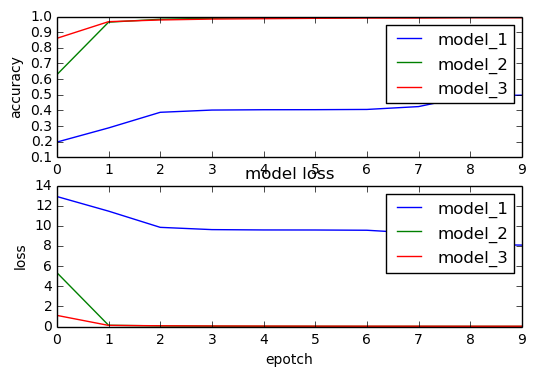


---
## Frameworks
---
Fei-Fei Li & Andrej Karpathy & Justin Johnson Lecture 12
22 Feb 2016

### Caffe 

#### Overview

+ Written in C++
+ Has Python and MATLAB bindings
+ Good for training or finetuning feedforward models

#### Pros/Cons

+ (+) Good for feedworward networks
+ (+) Good for finetuning existing networks
+ (+) Train models without writing any code!
+ (+) Python interface is pretty useful!
+ (-) Need to write C++ / CUDA for new GPU layers
+ (-) Not good for recurrent networks
+ (-) Cumbersome for big networks (GoogLeNet, ResNet)
---

### Theano

#### Overview

+ From Yoshua Bengio’s group at University of Montreal
+ Embracing computation graphs, symbolic computation
+ High-level wrappers: Keras, Lasagne

#### Pros/Cons

+ (+) Python + numpy
+ (+) Computational graph is nice abstraction
+ (+) RNNs fit nicely in computational graph
+ (-) Raw Theano is somewhat low-level
+ (+) High level wrappers (Keras, Lasagne) ease the pain
+ (-) Error messages can be unhelpful
+ (-) Large models can have long compile times
+ (-) Much “fatter” than Torch; more magic
+ (-) Patchy support for pretrained models
---

### Tensorflow

#### Overview

+ From Google
+ Very similar to Theano - all about computation graphs
+ Easy visualizations (TensorBoard)
+ Multi-GPU and multi-node training

#### Pros/Cons 

+ (+) Python + numpy
+ (+) Computational graph abstraction, like Theano; great for RNNs
+ (+) Much faster compile times than Theano
+ (+) Slightly more convenient than raw Theano?
+ (+) TensorBoard for visualization
+ (+) Data AND model parallelism; best of all frameworks
+ (+/-) Distributed models, but not open-source yet
+ (-) Slower than other frameworks right now
+ (-) Much “fatter” than Torch; more magic
+ (-) Not many pretrained models
---

### Torch

#### Overview

+ From NYU + IDIAP

+ Written in C and Lua

+ Used in Iot, Facebook, DeepMind

#### Pros/Cons

+ (+) Lots of modular pieces that are easy to combine
+ (+) Easy to write your own layer types and run on GPU
+ (+) Most of the library code is in Lua, easy to read
+ (+) Lots of pretrained models!
+ (-) Lua
+ (-) Less plug-and-play than Caffe
    : You usually write your own training code
+ (-) Not great for RNNs
---

    -Test several CNNs with different parameters and then plot some curves
    -Tuning some paramters Grdi search
    -Visualize some feature maps


```python

```
